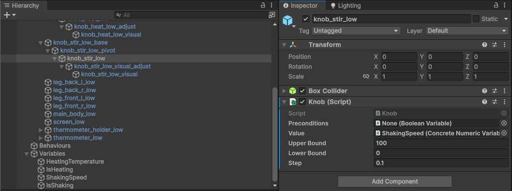
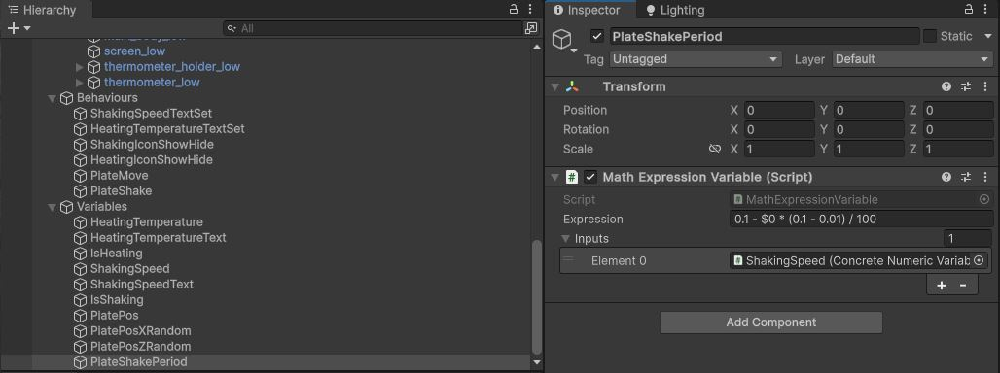

# V-Lab SDK for Unity Advanced Development Tutorial

Version 1.0.20240617

In this tutorial you will learn how to use the V-Lab SDK for Unity to set-up a complex, realistic interactive virtual object with multifaceted functionality for use in actual, real-world training applications. In particular, you will create a medical lab specimen shaker with additional heating capabilities. You only will use an original 3D model for the shaker and a variety of components provided by the SDK.

>**Tip:** Throughout this tutorial you will find tips that provide additional information or describe optional steps that will help you better understand what's been demonstrated that far.

## Prerequisites

Unity version 2023.2 or newer.

Unity UI package is required.

As in most cases with interactive 3D objects, the original 3D model must include separate, properly-aligned nodes for each point of interaction. For the purposes of this tutorial, this must be true for the on/off switch, the two knobs, all elements of the display and the plate. Also, the knobs must be aligned so as to rotate around their local y-axis. To support these requirements, a modified version of the Verov MS v03 magnetic stirrer model is available as a prefab under the tutorial's helper assets.

## Steps

The following is a step-by-step guide that will turn your static 3D model into an interactive virtual object with complex behaviour, visuals and sound.

### Step 0 - Import the V-Lab SDK

The first step is to import the SDK itself.

- Import the V-Lab SDK package by dragging-and-dropping the package file on the editor or via Assets > Import Package.

### Step 1 - Prepare the development environment

Next, a few key initial steps are required.

- Create a new scene.
- Open the Variable Inspector window by selecting V-Lab > SDK > Variable Inspector on the main menu.
- Create a top-level empty gameobject named "V-Lab".
- Add a ScreenUI component to the "V-Lab" gameobject.
- Set the "Max Press Duration" of the ScreenUI component to 0.33.

### Step 2 - Add the shaker to the scene

Next, you will add a shaker object to the scene.

- Create an instance of the shaker prefab in the scene (perhaps on some desk of your liking).
- Import TextMeshPro Essentials (if asked).

### Step 3 - Create placeholders for variables and behaviours

You will be able to group variables and behaviours as you create them progressively under easily-identifiable locations in the hierarchy.

- Create a top-level empty gameobject named "Variables".
- Create a top-level empty gameobject named "Behaviours".

### Step 4 - Create a knob to control heating

You will now create a turnable knob to control the heating temperature.

- Locate the "knob_heat_low" gameobject under V-Lab-Shaker > knob_heat_low_base > knob_heat_low_pivot.
- Add a Knob component.
- Configure it as shown.

### Step 5 - Create variables for heating

You will now create two heating-related variables: (a) a numeric variable to hold the heating temperature value as controlled by the heating control and (b) a flag to indicate if the instrument is in heating mode or not.

- Create an empty gameobject under Variables, name it "HeatingTemperature".
- Add a ConcreteNumericVariable component to it.

- Create an empty gameobject under Variables, name it "IsHeating".
- Add a NumericThresholdVariable component to it.
- Set the Input field of the NumericThresholdVariable you just created to the ConcreteNumericVariable created above by dragging the HeatingTemperature gameobject onto the field.

- Set Value field of the knob_heat_low gameobject's Knob component to the ConcreteNumericVariable created above by dragging the HeatingTemperature gameobject onto the field.

### Step 6 - Create a knob to control shaking

Similarly, you will now create a turnable knob to control the shaking speed.

- Locate the "knob_stir_low" gameobject under V-Lab-Shaker > knob_stir_low_base > knob_stir_low_pivot.
- Add a Knob component.
- Configure it as shown.

### Step 7 - Create variables for shaking

Like above, you will now create two shaking-related variables: (a) a numeric variable to hold the shaking speed as controlled by the shaking control knob and (b) a flag to indicate if the instrument is in shaking mode or not.

- Create an empty gameobject under Variables, name it "ShakingSpeed".
- Add a ConcreteNumericVariable component to it.

- Create an empty gameobject under Variables, name it "IsShaking".
- Add a NumericThresholdVariable component to it.
- Set the Input field of the NumericThresholdVariable you just created to the ConcreteNumericVariable created above by dragging the ShakingSpeed gameobject onto the field.

- Set the Value field of the knob_stir_low gameobject's Knob component to the ConcreteNumericVariable created above by dragging the ShakingSpeed gameobject onto the field.

>**Tip:** You have now achieved some basic functionality, that is, two turnable knobs that control the values of four variables. You can (and should) test this by entering play mode, exoerimenting with turning the knobs and observing the values of the variables on the Variable Inspector window, noticing, in particular, how the values of the IsHeating/IsShaking variables change from False to True as their input values become greate than zero:
>
> 
> 

>**Tip:** Modify the behaviour of the IsHeating/IsShaking variables so that they change from False to True at different input values than zero, for example 0.1, by appropriately adjusting their Threshold fields.

### Step 8 - Connect the display

You will now set-up the display to show eveything related to the instrument's operation, i.e., whether it is in heating and/or shaking mode, the heating temperature and the shaking speed. To achieve that, you will create a number of mapping variables to properly format values and convert them to the right types for text display, as well as effectors to show/hide icons.

- Create an empty gameobject under Variables, name it "ShakingSpeedText".
- Add a NumericToStringFormattedVariable component to it.
- Set the component's Input field to the ShakingSpeed variable by dragging the ShakingSpeed gameobject onto the field.
- Set the component's Format field to "000". This will result in a three-digit string padded with zeros even if the actual shaking speed value is single- or double-digit, which looks better on an electronic display.

>**Tip:** The NumericStringFormattedVariable component works with the same format strings as [Single.ToString(String)](https://learn.microsoft.com/en-us/dotnet/api/system.single.tostring) of Microsoft's .NET framework.

- Create an empty gameobject under Variables, name it "HeatingTemperatureText".
- Add an ExpressionToString component to it.
- Set the component's Input field to the HeatingTemperature variable by dragging the HeatingTemperature gameobject onto the field.
- Set the component's Expression field to "{0}°C". This will result in a string consisting of the heating temperature value followed by the Celsius sign.

>**Tip:** The ExpressionToString component works with the same format strings as [String.Format](https://learn.microsoft.com/en-us/dotnet/api/system.string.format) of Microsoft's .NET framework.

>**Tip:** As it should be clear by now, since your are only working with a single variable and not a complex, multi-variable expression for HeatingTemperatureText, you could have just used the simpler NumericStringFormattedVariable, as above, with a format string of "0°C". However, this is a good opportunity to introduce the powerful ExpressionToString component. Try to experiment with different expressions to get a feel of how it works.

>**Tip:** When adding new variables, remember to take advantage of the Variable Inspector to check out their values and how they change via the controls that drive them.
>
> 

- Create an empty gameobject under Behaviours, name it "ShakingSpeedTextSet".
- Add a TextMutator component to it.
- Set the TextMutator component's Input field to the ShakingSpeedText variable (by dragging the ShakingSpeedText gameobject onto the field, this technique should be clear by now and shall thus not be described any more).
- Locate the "RPMText" gameobject under V-Lab-Shaker > Display > Readings > CanvasAdjust > Canvas.
- Set the TextMutator component's Target field to the RPMText gameobject's Text component.

>**Tip:** Enter play mode to check out how the display now shows the shaking speed which changes as you turn the shaking control knob.

- Create an empty gameobject under Behaviours, name it "HeatingTemperatureTextSet".
- Add a TextMutator component to it.
- Set the TextMutator component's Input field to the HeatingTemperatureText variable.
- Locate the "TemperatureText" gameobject under V-Lab-Shaker > Display > Readings > CanvasAdjust > Canvas.
- Set the TextMutator component's Target field to the TemperatureText gameobject's Text component.

>**Tip:** Enter play mode to check out how the display now shows the heating temperature which changes as you turn the heating control knob.

- Create an empty gameobject under Behaviours, name it "ShakingIconShowHide".
- Add a GameObjectActivator component to it.
- Set the GameObjectActivator component's Input field to the IsShaking variable.
- Locate the "IconRun" gameobject under V-Lab-Shaker > Display > Icons.
- Set the GameObjectActivator component's Target field to the IconRun gameobject.

>**Tip:** Enter play mode to check out how the display now shows the shaking icon only when the shaking speed is greater than zero.

- Create an empty gameobject under Behaviours, name it "HeatingIconShowHide".
- Add a GameObjectActivator component to it.
- Set the GameObjectActivator component's Input field to the IsHeating variable.
- Locate the "IconHeat" gameobject under V-Lab-Shaker > Display > Icons.
- Set the GameObjectActivator component's Target field to the IconHeat gameobject.

>**Tip:** Enter play mode to check out how the display now shows the heating icon only when the heating temperature is greater than zero.

### Step 9 - Make the plate moveable

To create a shaking effect, you will first give the specimen plate the ability to move according to a 3D vector representing an absolute position or a relative displacement in the global or the plate's local coordinate system.

- Create an empty gameobject under Variables, name it "PlatePos".
- Add a NumericToVector3Variable to it.

- Create an empty gameobject under Behaviours, name it "PlateMove".
- Add a PositionMutatorComponent to it.
- Set the PositionMutator component's Input field to the PlatePos variable.
- Set the PositionMutator component's Precondition field to the IsShaking variable.
- Locate the "ceramic_plate_low" gameobject under V-Lab-Shaker > plate > ceramic_plate_pivot.
- Set the PositionMutator component's Target field to the ceramic_plate_low gameobject.
- Make sure Local is checked.
- Make sure Relative is unckeched.

### Step 10 - Make the plate shake

To complete the shaking effect, you will now give the plate the capability to shake on the horizontal plane randomly within a certain range and at a certain speed. To achieve that, you will (a) create two random number generators, appropriately transform their output and connect them to the x and z coordinates of the vector that specifies the plate's position, (b) create a periodic trigger that will force the plate to update its position according to those random inputs at a certain frequency, and (c) appropriately transform the value of the shaking speed variable and feed it to the periodic trigger to control its period and, thus, the speed at which the plate actually shakes.

- Create empty "PlatePosXRandom" and "PlatePosZRandom" gameobjects under Variables.
- Add a RandomFloatVariable to each one.
- Configure both of them as shown.

- Set the X Variable and Z Variable fields of the PlatePos gameobject's NumericToVector3Variable component to the PlatePosXRandom and PlatePosZRandom variables, respectively.

- Create an empty gameobject under Variables, name it "PlateShakePeriod".
- Add a MathExpressionVariable component to it.
- Configure it as shown, especially minding the "0.1 - $0 * (0.1 - 0.01) / 100" formula. This will map the value range [0-100], which comes from the ShakingSpeed variable, to [0.1-0.01], which is an appropriate range for the period of the periodic trigger that you will create next to control the plate shaking effect. Note that $0 refers to the first input variable in the component's array of inputs, that is, the ShakingSpeed variable.

- Create an empty gameobject under Behaviours, name it "PlateShake".
- Add a PeriodicTrigger component and a ComponentMutator component to it.
- Configure them as shown.

>**Tip:** To set the ComponentMutator's Target field, drag the PeriodicTrigger component by its title bar.

>**Tip:** Mind how ComponentMutator is used to modify the Period field of the PeriodicTrigger component. ComponentMutator is one of the most powerful components in the SDK as it allows you to route variable values to practically any field of any component in a gameobject hierarchy in the Unity engine.

>**Tip:** Enter play mode to check out how the plate now actually shakes and how the shaking speed can be adjusted with the shaking control knob.

### Step 11 - Add a heating effect

You will now create a simple heating visual effect, i.e., a circular area on the shaking platform becoming incandescent at an intensity related to the heating temperature controlled by the heating control knob. To achieve that, you will add an appropriately configured light source as a child of the plate gameobject in the hierarchy and set up a behaviour to modify its intensity.

- Locate the "ceramic_plate_low" gameobject under V-Lab-Shaker > Plate > ceramic_plate_pivot.
- Add a Spotlight child gameobject named "heat_light" to it and configure it as shown. Use the hexadecimal color value D43C07.

>**Tip:** The incandescence visual is simplistic on purpose - feel free to experiment with it to make it more realistic.

- Next, create empty gameobject under Variables, name it "HeatLightIntensity".
- Add a MathExpressionVariable to it.
- Configure it as shown. The formula "$0*20/316" maps the value range [0-316], which comes from the HeatingTemperature variable, to [0-20], which is an appropriate range for the intensity of the light source producing the incandescence effect.

- Next, create empty gameobject under Behaviours, name it "HeatLightIntensitySet".
- Add a LightIntensityMutator component to it.
- Configure it as shown.

>**Tip:** It should be clear by now that you could achieve the same effect using a ComponentMutator as in the case of the period of the periodic trigger that controls shaking speed created previously. The LightIntensityMutator is an optimized alternative provided to facilitate the use of light sources which can be employed to create a wide range of visual effects.

>**Tip:** Enter play mode to check out how the incandescence visual effect now appears at an intensity related to the heating temperature controlled by the heating control knob.

### Step 12 - Add sound

As a last step in this tutorial, you will now add sound to the instrument.

- Locate the "V-Lab-Shaker" gameobject.
- Add an AudioSource child gameobject named "Audio" to it and configure it as shown. You can find the "buzzing.wav" file under the tutorial's helper assets.

- Create empty gameobject under Variables, name it "ShakingSoundPitch".
- Add a MathExpressionVariable component to it.
- Configure it as shown. The formula "$0/100 + 1" maps the value range [0-100], which comes from the ShakingSpeed variable, to [1-2], which is an appropriate range for the pitch of the shaking sound effect.

- Create an empty gameobject under Behaviours, name it "ShakingSoundPitchSet".
- Add a ComponentMutator component to it.
- Configure it as shown.

>**Tip:** To set the ComponentMutator's Target field, create a new Inspector panel by right-clicking on the Inspector tab and selecting Add Tab > Inspector, undock the new inspector, select the "Audio" gameobject under V-Lab-Shaker, lock the undocked inspector by clicking on its lock icon, select the StirringSoundPitchSet gameobject and drag the AudioSource component by its title on the undocked inspector onto the Target field of the ComponentMutator on the docked inspector. Afterwards you can close the undocked inspector.

- Create an empty gameobject under Behaviours, name it "ShakingSoundOnOff".
- Add a GameObjectActivator component to it.
- Configure it as shown.

>**Tip:** Enter play mode to check out how shaking now actually produces a buzz sound and how the pitch of the sound changes depending on the shaking speed controlled by shaking control knob.

### Step 13 - Add an on/off switch

This is left as an exercise to the reader. You should create an on/off toggle switch as described in the basic development tutorial, connect a ConcreteBooleanVariable to it indicating whether the machine is on or off, set that variable as a precondition on controls and effectors as needed (experiment with that), and, also, create a behaviour based on a GameObjectActivator to show/hide the display when the variable is true/false, respectively.

## Summary

A total of 2 controls, 12 variables, 9 behaviours and 2 new gameobjects were required to achieve the intended interactivity and functionality of the V-Lab-Shaker virtual instrument using the V-Lab SDK.

Licensed under CC BY-NC 4.0.

Copyright (c) by Hellenic Open University.
