Version 1.0.20240617

In this tutorial you will learn how to use the V-Lab SDK for Unity to set-up a simple on/off switch/lamp system that demonstrates the SDK's basic principles and techniques.

You will not need any original assets to follow this tutorial, only Unity primitive geometry objects and components provided by the SDK.

>**Tip:** Throughout this tutorial you will find tips that provide additional information or describe optional steps that will help you better understand what's been demonstrated that far.

## Prerequisites

Unity version 2023.2 or newer.

Unity UI package is required.

## Steps

The following is a step-by-step guide that will take you from an empty scene to one with the switch/lamp system in just a few steps.

### Step 0 - Import the V-Lab SDK

The first step is to import the SDK itself.

- Import the V-Lab SDK package by dragging-and-dropping the package file on the editor or via Assets > Import Package.

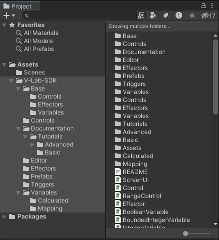

### Step 1 - Prepare the development environment

Next, a few key initial steps are required.

- Create a new scene.
- Open the Variable Inspector window by selecting V-Lab > SDK > Variable Inspector on the main menu.
- Create a top-level empty gameobject named "V-Lab".
- Add a ScreenUI component to the "V-Lab" gameobject.
- Set the "Max Press Duration" of the ScreenUI component to 0.33.

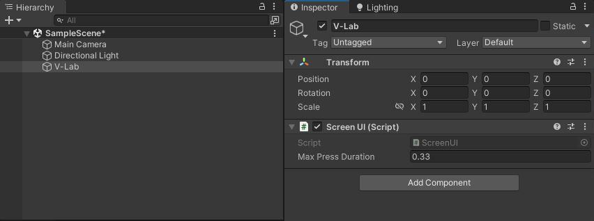

### Step 2 - Create placeholders for variables and behaviours

You will be able to group variables and behaviours as you create them progressively under easily-identifiable locations in the hierarchy.

- Create a top-level empty gameobject named "Variables".
- Create a top-level empty gameobject named "Behaviours".

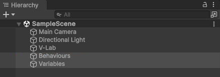

>**Tip:** The three steps above are necessary and the same every time you want to use the V-Lab SDK.

### Step 3 - Create the switch

You will now create a very simple model for the switch in its off state.

- Create a Cube gameobject named "Switch" at position (0, 0, 0), a 90 rotation arount the y-axis and a (1, 1, 1) scale.
- Create a material for the body of the switch with a color of your choice, name it "SwitchBodyMat" and assign it to the Switch gameobject.
- Add a Cube child gameobject to the Switch gameobject and name it "SwitchButton".
- Remove its collider component.
- Create a material for the switch button with a distinctive color of your choice for when the switch is off (e.g., red), name it "SwitchOffMat" and assign it to the SwitchButton gameobject.
- Complete the configuration of the SwitchButton gameobject as shown.

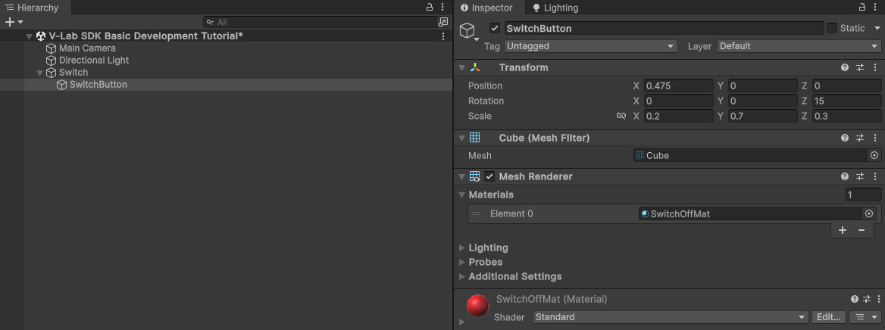

- The result is as shown.

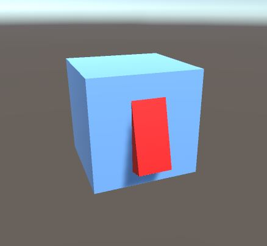

>**Tip:** Keep in mind that this is how the switch is structured, and looks, when off. There is nothing yet for the switch in its on state. This is very much intentional.

### Step 4 - Add structure and visuals for when the switch is on

You will now add content to the switch to represent its structure and appearance when on. Essentially, this means that the full Switch hierarchy represents the switch in two states simultaneously, i.e., on and off. This is because, in the steps that follow, you will apply a very simple but powerful technique enable interactivity, that is, switching between different, fully pre-configured states of a virtual object.

- Rename the SwitchButton gameobject to "SwitchButtonOff".
- Right-click on SwitchButtonOff and select "Create Empty Parent", name the new parent "SwitchButton".
- Duplicate SwitchButtonOff, name the new gameobject "SwitchButtonOn".
- Set the z-axis rotation of the SwitchButtonOn gameobject to -15.
- Create a material for the switch button with a distinctive color of your choice for when the switch is on (e.g., green), name it "SwitchOnMat" and assign it to the SwitchButtonOn gameobject.

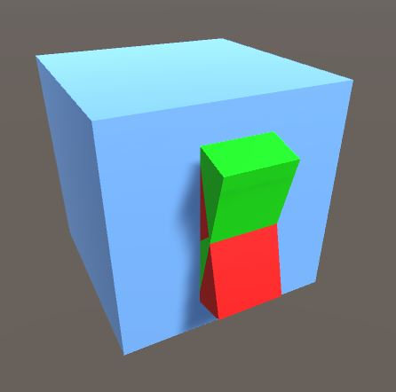

### Step 5 - Add interactivity

You will now add basic interactivity. You will make the switch clickable and create a variable that toggles between true and false as you click on the switch to represent the state the switch is in at any given moment.

- Add a Box Collider to "SwitchButton" and configure it as shown.

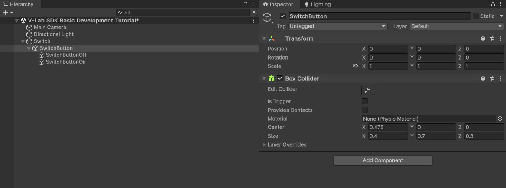

>**Tip:** This is to create an interactive volume around the switch button.
> 
> 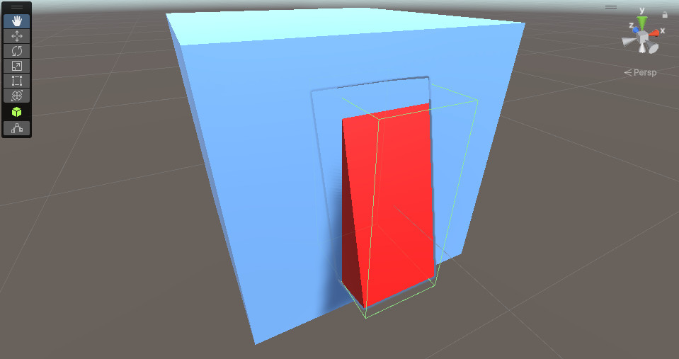

- Create an empty gameobject under Variables, name it "SwitchState".
- Add a ConcreteBooleanVariable component to it.
- Add an OnOffSwitch component to the SwitchButton gameobject.
- Set the State field of the OnOffSwitch component to the ConcreteBooleanVariable created above by dragging the SwitchState gameobject.
- Enter play mode and use the Variable Inspector to observe how the value of the SwitchState variable changes between true and false as you click on the switch.

### Step 6 - Make the switch change appearance

You will now make the switch look as it should depending on its state.

- Create an empty gameobject under Variables, name it SwitchStateIndex.
- Add a BooleanToInt component to it.
- Configure it as shown.

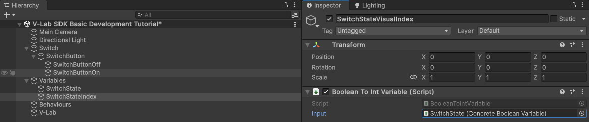

>**Tip:** Use the variable inspector to observe how the SwitchStateVisualIndex variable changes between 0 and 1 as you click on the switch.

- Create an empty gameobject under Behaviours, name it "SwitchStateVisualSet".
- Add a GameObjectSwapper component to it.
- Configure it as shown.

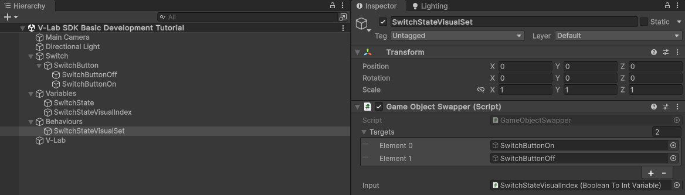

- Enter play mode, verify that the appearance of the switch now changes depending on whether it is on or off, and use the Variable Inspector to observe how the value of the SwitchState variable corresponds with the appearance of the switch at any given moment.

### Step 7 - Create a lamp with on and off states

Similarly to how you set-up structure and appearance for the two states of the switch above, you will now crete a lamp that can be either on or off and emitting light only if on.

- Create a top-level empty gameobject, name it "Lamp", set its y-axis position to 1.5 to place it above the switch.
- Add a Sphere gameobject to Lamp, name it "LampOff".
- Create a material for the lamp with a distinctive color of your choice for when the lamp is off (e.g., black), name it "LampOffMat" and assign it to the LampOff gameobject.
- Add a Sphere gameobject to Lamp, name it "LampOn".
- Create a material for the lamp with a distinctive color of your choice for when the lamp is on (e.g., emissive yellow), name it "LampOnMat" and assign it to the LampOn gameobject.
- Add a PointLight child gameobject to LampOn, change its Indirect Multiplier field to 0.

### Step 8 - Make the lamp respond to the switch

As a last step in this tutorial, you will now make the lamp switch between its on and off state depending on the state of the switch.

- Create an empty gameobject under Behaviours, name it "LampStateSet".
- Add a GameObjectSwapper component to it.
- Configure it as shown.

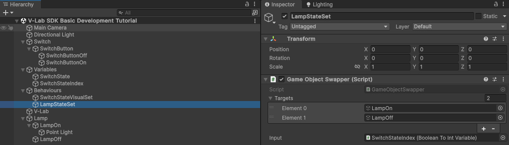

- Enter play mode, verify that the appearance of the lamp now changes depending on whether the switch is on or off and that it emits light only when on.

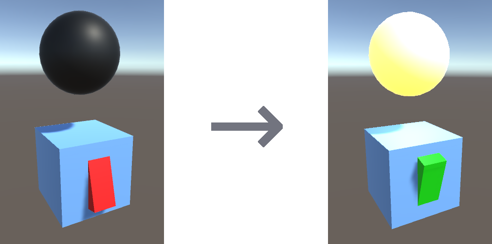

## Summary

A total of 1 control, 2 variables and 2 behaviours were required to create a simple on/off switch/lamp interactive virtual object system using the V-Lab SDK.

Licensed under CC BY-NC 4.0.

Copyright (c) by Hellenic Open University.
